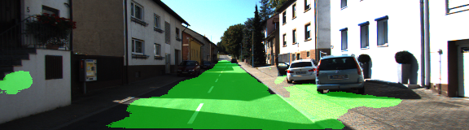

# Semantic Segmentation

The goal of this project is to perform semantic segmentation on images to label pixels of a road using a [Fully Convolutional Network](https://arxiv.org/abs/1411.4038). Semantic segmentation is the task of finding what's in an image at the pixel level. It can be used by autonomous cars for scene understanding. For example, infering the drivable surfaces in an image (road) or objects to avoid (other vehicles, pedestrians) at a fine resolution.

### Setup

##### Dataset
Download the [Kitti Road dataset](http://www.cvlibs.net/datasets/kitti/eval_road.php) from [here](http://www.cvlibs.net/download.php?file=data_road.zip).  Extract the dataset in the `data` folder.  This will create the folder `data_road` with all the training and test images.

##### Pretrained VGG model
`helper.py` downloads the pretrained frozen vgg model if it doesn't exist. Note that it's already convolutionalized, i.e, the fully connected layers have been replaced by convolutional layers. 

##### Dependencies
`conda env create -f environment.yml`

##### Run

`python main.py`

### Implementation

FCN8 from [Fully Convolutional Networks for Semantic Segmentation](https://arxiv.org/abs/1411.4038) is implemented and trained end to end. A [VGG16](https://arxiv.org/pdf/1409.1556.pdf) network pretrained on ImageNet is used as the encoder network. The final classification layer is removed. Fully connected layers are replaced by convolutional layers by using kernels covering the entire input region to output spatial maps. More explanation about the conversion can be found [here](http://cs231n.github.io/convolutional-networks/#convert). 1x1 convolutions are used to output `num_classes` as the channel dimensions. `num_classes` here is 2: road and non-road. It's then upsampled to the original size of the image. Upsampling is done by using transposed convolutional layers. Skip connections are used to combine semantic information from deep coarse layers with location information from shallow fine layers (1x1 convolutionalized pool3 and pool4 layers). Before this, pool3 and pool4 layers are scaled as mentioned by the authors in their [github repo](https://github.com/shelhamer/fcn.berkeleyvision.org). The loss function is the sum of the cross entropy loss between the pixel predictions and ground truth and L2 regularization loss of the decoder kernels. The network is trained with an Adam optimizer with a fixed learning rate of 1e-3 for 50 epochs. 

### Results

### References

- [Fully Convolutional Networks for Semantic Segmentation](https://arxiv.org/abs/1411.4038)
- https://github.com/shelhamer/fcn.berkeleyvision.org
- [A guide to convolution arithmetic for deep learning](https://arxiv.org/abs/1603.07285)
- http://blog.qure.ai/notes/semantic-segmentation-deep-learning-review
